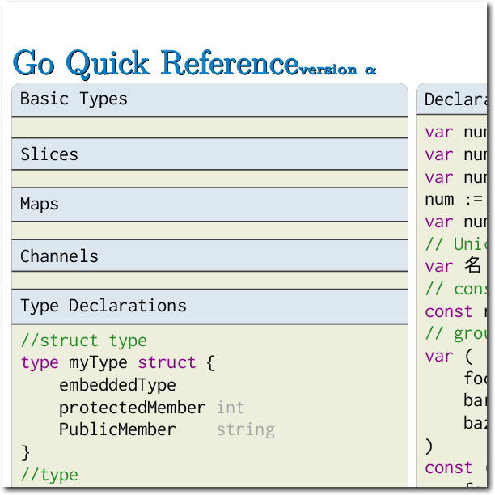

# golang-ref-sheet

It's your desktop concurrency buddy!

## Why?

Because I saw a need for a decent, technically-vetted reference sheet that would also look good laminated and hung on the wall.  And because, let's face it, those pictures of you at the beach just aren't cutting it any more.  You didn't even like that trip.

## What's it look like?

Here are some thumbnails (more to follow, as the document fleshes out):



## Where do I get it?

[Here!](https://raw.githubusercontent.com/alaska/golang-ref-sheet/master/golang-ref-sheet.pdf)

## Building your own

Requirements:
* LuaLaTex
* pygments
* pygments-style-solarized

### Getting LuaLaTex:

* OSX
  * Do not use brew. Well, you can try, but you can't (see below)
  * [MacTeX](https://tug.org/mactex/mactex-download.html) (large version)
* Ubuntu
  * `sudo apt-get install texlive-full` (should get everything you need, please file an issue if more is required or a smaller subset will still work)
* Windows
  * Still working on this one. Will almost certainly require a new build script, at the very least, unless you do it with cygwin. PRs VERY welcome, as this is currently low priority.

TeX and its variants are notoriously difficult to install from source. For example:

```
$ brew install tex
Error: No available formula with the name "tex"
Installing TeX from source is weird and gross, requires a lot of patches,
and only builds 32-bit (and thus can't use Homebrew deps on Snow Leopard.)

We recommend using a MacTeX distribution: https://www.tug.org/mactex/
```

So, that's where I recommend you get it, too.  And, in all honesty, MacTeX is a pretty solid bundle and likely to be adequate for all your tex-based needs. Seriously, you could publish academic papers from now to kingdom come with everything there, and the `Tex Live Utility` update manager and `TeXShop` editor aren't too shabby, either.

### Getting Pygments

`pip install pygments pygments-style-solarized` Easy-peasy.

Why am I using pygments instead of an all-tex solution like listings?  I originally did, actually. Give it a look see in the older versions.  It works okay, but it's honestly kind of a pain to get right and configure. In particular, I had difficulty with getting `othersymbols` to render consistently and, in the end, the `minted` package (which runs Pygments) was just easier to use, suported more options, and looked better.

### Running build.sh

* `$ ./build.sh`
  * Build the .pdf in `$TMPDIR` and copy it here when done
* `$ BUILD_DIR=~/somewhere/else ./build.sh`
  * Build the .pdf somewhere else, for some reason
* `$ ./build.sh -p /path/to/pdf/viewer`
  * Build the .pdf and preview it with your viewer of choice when it's done
* `$ ./build-sh -g`
  * Build the .pdf and re-generate the preview graphics for the github page (also requires ImageMagick, but we don't expect a lot of people to do this)

## Contributing

I think for now I'll only be accepting PRs to the .tex file itself so that I can vet that they render correctly. As new developers come on, some of them might be able to just push the .pdf and previews themselves.
